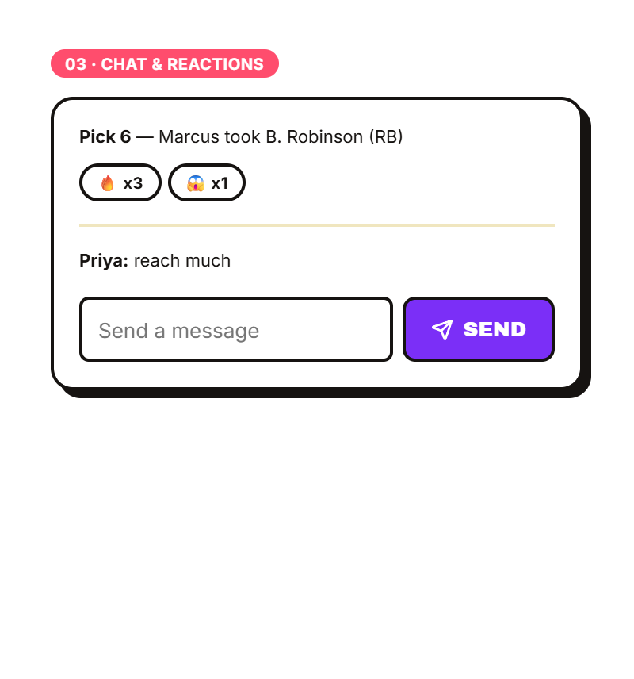
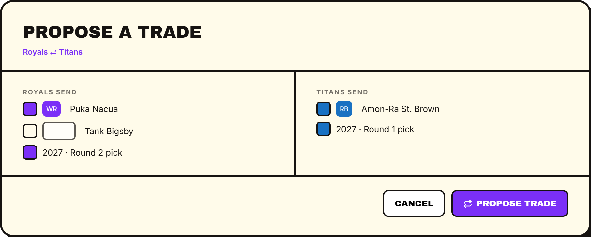
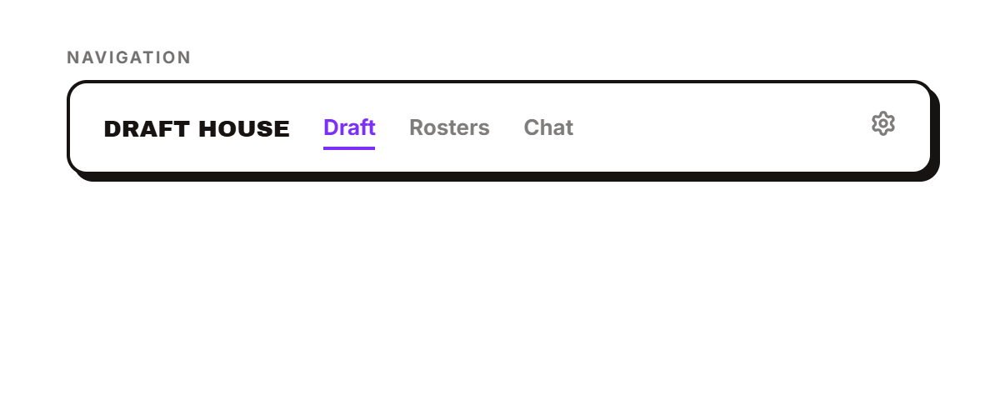
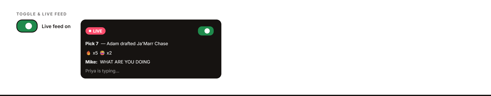
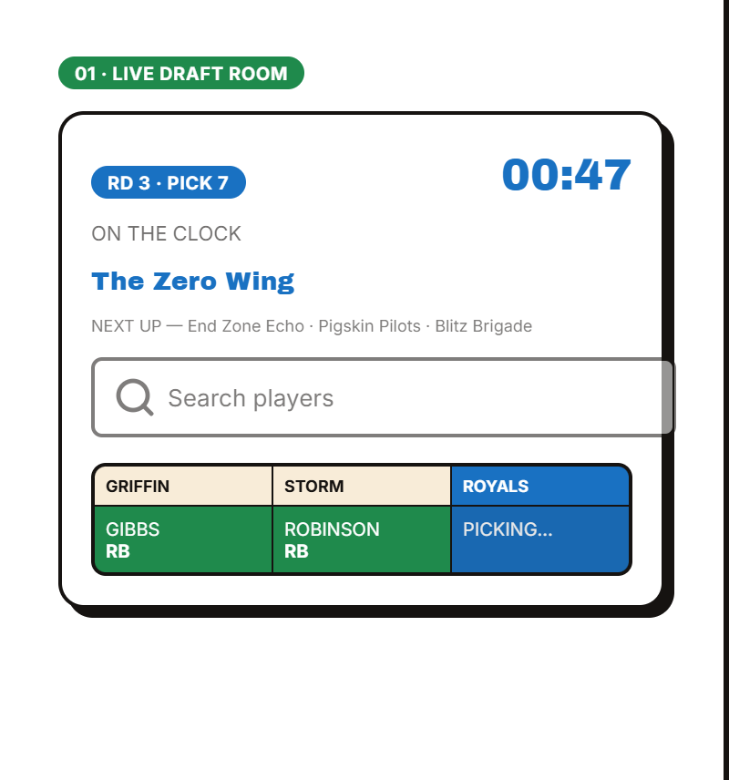
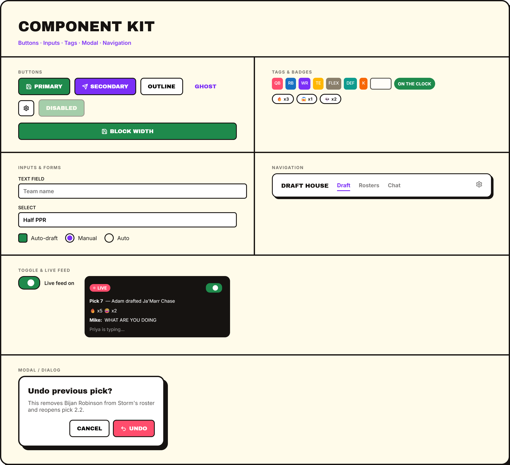
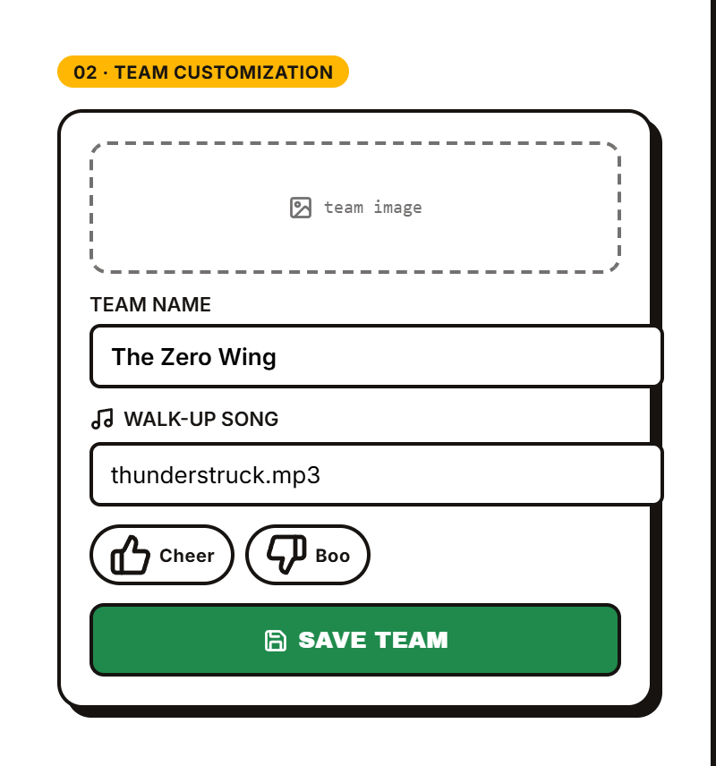
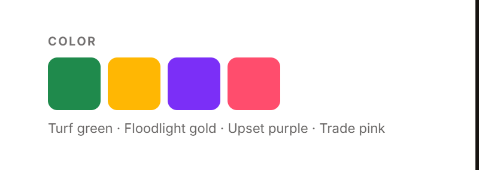
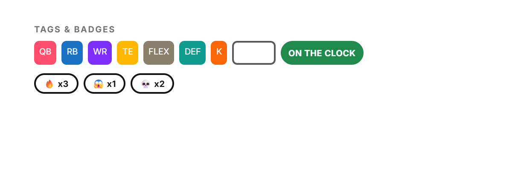

# Draft House Design Blueprint

Living design system for Draft House. Sections below are updated as decisions are made — see `Draft House Brand Sheets.dc.html` for the visual reference (layout direction: **2c, asymmetric split**). It captures decisions already made and identifies areas that still require definition before implementation.

---

## 1. Brand Identity

### Purpose
Define the personality and visual identity of Draft House as a distinct product.

### Decisions

- **Name**: Draft House
- **Core Concept**: A private, social, real-time fantasy football draft experience
- **Audience**: Family and friends leagues (not competitive public play)
- **Personality**: Entertaining, social, respectful but playful competition
- **Visual style**: Bold and colorful, not corporate-sporty — thick black outlines, flat "comic-panel" drop shadows (offset, not blurred), rounded corners, big Archivo Black headlines. Playful energy over minimal restraint.
- **Logo**: No illustrated mark. Wordmark "DRAFT HOUSE" in Archivo Black, flush left, paired with a small three-bar mark (three rounded bars, short → tall → short, in green / pink / purple, always in that order).
- **Visual motif**: Position-color coding carried everywhere a player appears (see §3), thick 2px black outlines on every card/input/button, and a signature hard offset shadow (5px 5px 0 ink) instead of soft blur.

### Still to define
- Photography / illustration style (no real product photography needed yet — no imagery in the app beyond user-uploaded team images)

---

## 2. Design Principles

### Purpose
Establish guiding principles for all design decisions in Draft House.

### To Define
- Clarity vs. entertainment (balance)
- Accessibility requirements
- Performance / animation budgets
- Mobile-first vs. desktop-first approach (draft room is desktop-first per §9/§23, but not formally decided project-wide)
- Real-time feedback latency targets
- Error handling patterns

---

## 3. Color System



### Decisions — "Turf & Floodlight" palette

| Role | Value | Usage |
|---|---|---|
| Background | `#fffbea` (warm cream) | Page/canvas ground |
| Ink | `#161311` (near-black) | Text, outlines, borders |
| Green | `#1f8a4c` | **On the clock / timer / current pick** — reserved exclusively for the active-pick state; also used for primary/save actions |
| Gold | `#ffb703` | TE position tag; secondary emphasis, team-customization category |
| Purple | `#7b2ff7` | WR position tag; secondary actions (send, trade) |
| Pink | `#ff4d6d` | QB position tag; chat/social category |
| Blue | `#1971c2` | RB position tag |
| Teal | `#0f9b8e` | DEF position tag |
| Orange | `#f76707` | K position tag |
| Flex gray | `#8a7f6b` | FLEX position tag — muted/neutral since it isn't a single fixed position |
| Bench (outline) | white fill, ink border | BENCH tag — outlined, not filled, since bench isn't an active roster position |

Rules:
- Position colors are fixed and semantic: QB pink, RB blue, WR purple, TE gold, DEF teal, K orange, FLEX gray, BENCH outline. Never reassign.
- "On the clock" state (timer, active team, active pick cell) always uses green, independent of that team's or player's position color — chosen because green isn't used for any position, so the active pick never collides with a roster color.
- Reaction pills are outlined (white fill, black border), never color-filled — so the emoji itself stays legible.
- Accent colors rotate freely for section labels/categories (§6 tags), but position chips and the clock indicator follow the rules above strictly.

### To Define
- Status colors for error/warning/success (distinct from the brand accents above)
- Dark mode

---

## 4. Typography



### Decisions
- **Headings**: Archivo Black, uppercase where used for labels/kickers
- **Body**: Inter, regular/medium/semibold/bold (400–700)
- H1 ~40–56px depending on context (brand lockup vs. section header)
- Kicker/label text: 10–11px, uppercase, letter-spacing ~0.06–0.12em, bold
- Body/UI text: 11–14px in dense interface contexts (draft board, cards)

### To Define
- Full H1–H6 scale for marketing/long-form contexts (not just interface chrome)
- Line-height standards outside of card components

---

## 5. Layout & Spacing

### Decisions
- Card corner radius: 10–14px; inputs/buttons 6–8px; avatar/position chips 4–6px
- Card border: 2px solid ink
- Card elevation: hard offset shadow `5px 5px 0 var(--ink)` (no blur) — the signature elevation treatment, used instead of soft drop shadows
- Dashed 2px border for upload/empty slots (team image)

### To Define
- Base spacing unit / scale
- Grid system, breakpoints, container widths (beyond the poster/brand-sheet compositions)
- Safe areas for mobile devices

---

## 6. Components

### Buttons — Decisions
- Primary action: solid fill (green for save-type actions, purple for send-type actions), white text, 2px ink border, 6–8px radius
- Icon + label, icon leading (e.g. save icon + "SAVE TEAM", send icon + "SEND")
- Icons from **Lucide** (loaded via CDN), 14px, stroke-width ~2.4 to match the bold outline style

**To Define**: hover/active/disabled states, loading states, size scale

### Cards — Decisions
- White fill, 2px ink border, 10–14px radius, hard offset shadow (see §5)
- Internal padding ~16px, 8–10px gap between stacked elements

**To Define**: list spacing, nested-card rules

### Input Fields — Decisions
- 2px ink border, white fill, 6px radius, ~14px text
- Label sits above the field, 10–11px bold, uppercase-style tone (not necessarily uppercase text)
- Icon-labeled fields (e.g. walk-up song) show a leading Lucide icon next to the label, not inside the input

**To Define**: focus ring color/style, error state, dropdown/checkbox/radio styling

### Badges & Tags — Decisions



- Pill shape, 3px/9px padding, bold 10–11px text
- Filled pills (white text on accent) for category labels ("01 · LIVE DRAFT ROOM", position chips)
- Outlined pills (white fill, ink border/text) for **reactions** (so the emoji reads clearly) and for **BENCH** (a non-active roster slot, so it reads as "off")

### Modals / Dialogs — Decisions
- White card, 3px ink border, 16px radius, hard offset shadow (8px 8px 0 ink) — same elevation language as cards, scaled up
- Title in Archivo Black, supporting copy in Inter at reduced opacity, actions right-aligned (outline "cancel" + filled accent confirm)

### Navigation — Decisions



- Light card (white fill, ink border, hard offset shadow) rather than a dark bar — keeps the nav in the same visual family as cards/buttons instead of reading as separate "web app chrome"
- Wordmark flush left, links inline with reduced opacity, active link gets full opacity + purple underline; utility icon (settings) pinned right

### Component Kit — Reference sheet


Buttons, tags, form fields, navigation, modal, and the toggle/live-feed pattern, assembled as one reference sheet (see `Draft House Brand Sheets.dc.html`, section 3a).

### Toggle & Live Feed — Decisions



- Standard pill toggle: white/ink off, green fill + white knob when on
- Live Feed is a dark streamer-style overlay panel (ink background, white text) — a "LIVE" pill badge with a pulsing dot, pick announcements, reactions, and typing indicators stack as compact rows
- The feed's own on/off toggle sits inside the panel, so it's dismissible without leaving the draft room
- Distinct from the light chat/activity feed (§14/§16) — this overlay sits on top of the board, not inline in a sidebar

---

## 7. Draft Lobby

### Purpose
The initial screen where users gather before the draft begins.

### Current Design

The lobby displays:
- League name at the top
- Live countdown timer ("Draft begins in HH:MM:SS")
- All teams in draft order
- Per-team information: position, team name, player name, ready status
- Unclaimed teams marked as "Waiting..."
- Real-time updates as players join

### Interactions

- Click a team to view team profile popup
- Teams update live without page refresh

### To Define

- Exact layout (sidebar vs. main grid vs. card layout)
- Team card visual design
- How to distinguish claimed vs. unclaimed teams
- Color coding for ready/waiting status
- Desktop vs. mobile layout differences
- Scroll behavior if many teams
- Commissioner "Start Draft Now" button placement and styling
- How the countdown timer displays and animates

---

## 8. Team Profile Popup

### Purpose
Display detailed team information when a user clicks a team in the lobby.

### Current Design

Information displayed:
- Team image
- Sleeper team name
- Draft House team name (editable)
- Player's real name
- Draft position
- Family league championship count
- Commissioner-written anecdote

### To Define

- Popup size and positioning
- How championship history is displayed (badge, list, year-by-year)
- Anecdote text styling and character limits
- Close button styling
- Animation (entrance/exit)
- Mobile popup behavior (full screen vs. bottom sheet?)

---

## 9. Draft Room

### Purpose
The main interface during the live draft. One of the most important screens.

### Current Design

The draft room contains:
- Draft board / player pool
- Current picker indicator
- Timer (with commissioner controls)
- Team rosters (current state)
- Activity feed (picks + chat)
- Emoji reactions
- Commissioner controls
- Walk-up music player/mute controls

### Decisions (from brand sheet 2c / 2a reference)



- Header ticker: round + pick number tag (clock-green, see §3), countdown timer in clock-green Archivo Black numerals, "ON THE CLOCK" label + team name in clock-green, "NEXT UP" ticker listing upcoming teams
- Player search: pill-shaped search field with leading search icon, inline above the board
- Draft board: team-name column headers, position-colored player chips inside each round row, the active cell shown in clock-green with "PICKING…"
- Commissioner menu surfaced as a row of outlined action pills (undo pick, skip pick, edit picks, in-draft trade, take a break) rather than a hidden overflow menu — kept visible since this is a small, trusted family-league group, not hidden behind a "···" affordance

### To Define

- Full desktop grid composition (rosters, activity feed, and board together at real draft-room scale — the brand sheets show a poster-scale excerpt, not the full room)
- Player card data density (ADP, bye week, rankings)
- Current picker indication beyond the header ticker (e.g. board highlighting)
- Mobile draft room (significant re-organization for phone screens — current pick, search, roster, chat in tabs or stacked)

**Fandraft Reference & scope note**: The `fandraft-image/reference-images/` screenshots are layout inspiration only, not a feature spec — don't replicate them closely enough to look like a clone of that product. They show several features that are **explicitly not part of Draft House** unless a future update to these docs adds them: player pick queue (pre-selecting upcoming picks), skip pick, draft break, keeper-on-the-fly, team-on-the-fly, alternate board views (Roster/Position/Round Summary/Player List), and announcer voice options. Build only what's documented elsewhere in this repo.

---

## 10. Player Cards

### Purpose
Individual player representations in the draft pool and search results.

### Decisions
- Position-colored chip: name + bold position abbreviation, color per §3
- "On the clock" cell uses clock-green with "— on clock —" / "PICKING…" label instead of a player name

### To Define

- ADP/bye/ranking display
- Hover/focus states
- Selected state
- Disabled state (if player is already drafted)
- Card size and spacing
- Icon usage for positions/teams
- Text truncation for long names
- Mobile card layout (taller, narrower?)

---

## 11. Team Cards / Rosters

### Purpose
Display a team's current roster and available bench spots.

### Current Design

Shows drafted players and remaining roster slots.

### To Define

- Layout (grid vs. list)
- How positions are labeled
- Empty slot styling
- Player card styling within roster
- Team name and image placement
- Scroll behavior for benches
- Mobile roster layout

---

## 12. Draft Clock

### Purpose
Display the current pick timer and allow the commissioner to control it.

### Current Design

Shows seconds remaining for the current pick.

Commissioner controls:
- ▶/II (Pause/Play)
- ✎ (Edit)
- ↻ (Reset)

### Decisions
- Large Archivo Black numerals in clock-green (§3) — the same color used everywhere else "on the clock" appears, for one consistent read of "it's happening now"

### To Define

- Low-time warning state
- Circular/bar alternatives
- Edit dialog styling and size
- Reset confirmation (if needed)
- Clock size on desktop vs. mobile

---

## 12a. Trade Builder

### Purpose
UI for proposing a trade between two teams (see [TRADES.md — Trade Offers](TRADES.md#trade-offers) for the v1 propose/accept/reject scope).

### Decisions



- Two-column proposal layout: one column per team, each listing that team's own tradeable assets
- Assets are checkbox rows — players (with position chip) and draft picks (year + round) live in the same list, so either can be selected interchangeably
- Header names both teams ("Royals ⇄ Titans"); footer has an outline Cancel + filled purple "Propose Trade" (send-family action, per §3 color rules)

### To Define
- Trade value/fairness indicator
- Counter-offer flow (post-MVP, see DRAFT_ENGINE.md)
- Pending-trade notification state

---

## 13. Commissioner Controls

### Purpose
Tools for the commissioner to manage the draft.

### Current Design

Controls available:
- Pause/Resume draft
- Edit clock (change timer)
- Reset clock (return to configured duration)
- Manually assign a player to a team
- Undo a pick
- Control empty teams (manual vs. auto-draft)

### Decisions



- Visible action-pill row (see §9), not a hidden menu — undo pick, skip pick, edit picks, in-draft trade, take a break
- Pills use the outlined "reaction" style with a leading Lucide icon (undo-2, skip-forward, pencil, repeat, pause)

### To Define

- Confirmation dialogs for destructive actions (undo, manual pick, reset)
- Visual feedback when an action is processed
- Mobile layout for commissioner controls

---

## 14. Activity Feed

### Purpose
Real-time log of draft picks, chat messages, and reactions.

### Current Design

Shows:
- Pick announcements with draft chime
- Player reactions (emoji)
- Chat messages from participants
- All updating in real-time

Flow:
```
┌─────────────────┐
│ 🏈 Adam drafted │
│ Bijan Robinson  │
│ 😂 😂 🔥       │
├─────────────────┤
│ Mike:           │
│ "WHAT ARE YOU   │
│  DOING?"        │
└─────────────────┘
```

### Decisions
- Pick announcements shown as plain text rows ("Pick 6 — Marcus took B. Robinson (RB)") above a divider from chat messages
- Reactions attach directly below the pick row as outlined pills with emoji + count (see §16)

### To Define

- Avatar/name display for users
- Timestamp display (show time or just relative?)
- Scroll behavior (auto-scroll to newest?)
- How chat messages are styled (distinct from pick rows)
- Mobile feed layout (full-width vs. narrow?)

---

## 15. Chat & Direct Messages

### Purpose
Enable live communication during the draft.

### Current Design

- Public activity feed in draft room (picks + reactions + messages)
- Private direct messages between players (separate conversation UI)

### To Define

- DM interface styling (sidebar, modal, or full screen?)
- Conversation list
- Message input field styling
- Unread indicators
- Timestamps
- Avatar/name display
- Mobile DM layout
- Notification style (badges, badge count?)

## 15a. Streamer-style Live Feed (overlay)

### Purpose
An optional, dismissible overlay ticker — distinct from the sidebar activity feed above.

### Decisions


- Optional overlay, toggled on/off independent of the main chat/activity panel — a compact scrolling ticker of picks, reactions, and messages without opening the full sidebar
- Dark ink background with white text (only surface in the system that inverts), reading as a distinct, dismissible layer over the board
- Rows: pick announcements (bold pick + team + player), reaction summaries, chat lines, typing indicator

### To Define
- Position/placement on the draft room
- Max row count / scroll behavior
- Entrance/exit animation

---

## 16. Reactions / Emoji Picker

### Purpose
Allow players to react to picks with emoji.

### Current Design

Emoji reactions below picks:
```
😂  🔥  🤡  💀  😭  👀
```

Aggregate counts optional:
```
😂 7    🔥 3    🤡 5
```

### Decisions
- Reaction pills are always outline style (white fill, ink border, ink text) — never a colored fill — so the emoji is never fighting a background tint
- Shown as emoji + count ("🔥 x3")
- Max reactions per pick: 5 distinct emoji per user, enforced server-side via a Postgres trigger — see [REALTIME.md — Rate Limiting](REALTIME.md#rate-limiting--abuse-prevention)

### To Define

- Which emoji are available by default?
- How is the emoji picker accessed (click, hover, button)?
- Emoji picker UI (grid, search, categories?)
- Can users change/remove their reaction?
- How do reactions animate when added?
- GIF reactions (post-MVP feature)?

---

## 17. Walk-Up Music

### Purpose
Audio experience when a player is on the clock (Round 1 only).

### Current Design

- Song plays when player's turn begins in Round 1
- Everyone hears it (unless they mute)
- Plays only during Round 1
- Users can upload their own song during account creation or team claiming
- Mute controls: separate toggles for Music and Draft Sounds

### Decisions
- Walk-up song field is a labeled input with a leading music icon on the label
- Cheer/Boo reactions shown as outlined pills with thumbs-up/thumbs-down icons

### To Define

- Music player UI (play/pause, progress, volume?)
- Where is the music player located in the draft room?
- Mute button styling and placement
- Upload interface styling
- Accepted file formats and max file size
- Upload progress indicator
- Error handling for upload failures
- How is currently playing song indicated?
- Mobile player layout

---

## 18. Team Customization Screen

### Purpose
Allow users to personalize their team identity.

### Current Design

Users can customize:
- Team name (independent of Sleeper)
- Team image (upload or replace Sleeper image)
- Walk-up song (upload audio file)

### Decisions



- Team image: dashed 2px border upload slot with a leading image icon and "team image" placeholder label
- Team name: labeled text input
- Walk-up song: labeled input with music icon + Cheer/Boo reaction pills
- Save action: primary green button with a save icon, full-width in the compact card layout

### To Define

- Drag-and-drop behavior
- Image cropping/sizing
- Upload progress/error states

---

## 19. Team Claiming Screen

### Purpose
Allow users to select their team from available options after creating an account.

### Current Design

Shows available teams and already-claimed teams:
```
AVAILABLE
The Hoodlums [ Claim ]
Touchdown Jesus [ Claim ]
Dad's Retirement Plan [ Claim ]

CLAIMED
Adam — The Hoodlums
Sarah — Touchdown Jesus
```

### To Define

- Section styling (cards, list, grid?)
- How to distinguish available vs. claimed visually
- Claim button styling
- Real-time updates as teams are claimed
- Navigation back if user cancels
- Mobile layout

---

## 20. Authentication & Account Screens

### Purpose
Screens for creating accounts and logging in.

### Current Design

Users provide:
- Username
- Password
- Display name

No external OAuth (Google, Apple, Facebook). See [DATABASE.md — users](DATABASE.md#1-users) for the synthetic-email implementation behind this.

### To Define

- Form layout
- Input field styling
- Password requirements and display
- Validation messaging
- Error states
- Success/redirect after signup
- Login screen styling
- "Forgot password" flow (if implemented)
- Mobile-optimized forms

---

## 21. League Setup Screens

### Purpose
Initial configuration after Sleeper import.

### Current Design

**Screen 1: League Settings Review**
- League name
- Number of teams
- Scoring format (e.g., Half PPR)
- Roster construction
- Edit button for making changes

**Screen 2: Draft Settings Review**
- Draft format
- Timer per pick
- Pick trading enabled/disabled
- Draft order
- Auto-draft settings
- Edit button for making changes

### To Define

- Layout and spacing for configuration review
- Table or card styling for settings display
- Modal/inline styling for edit mode
- Validation and error handling
- Confirmation dialogs
- Navigation (back, next, cancel)
- Mobile layout for multi-field configuration

---

## 22. Desktop Layout

### Purpose
Optimize the draft room and key screens for desktop viewing.

### Current Design

Should accommodate:
- Large draft board
- Player pool/search
- Team rosters
- Activity feed
- Timer and controls
- Wide viewport (1920px+, 1440px typical)

### To Define

- Use of sidebars vs. main content area
- Split-pane layouts
- Multi-column layouts
- Relative sizing of sections
- Sticky headers/footers
- Scrollable areas
- Keyboard shortcuts or hotkeys?

---

## 23. Mobile Layout

### Purpose
Optimize the draft room and key screens for mobile/phone viewing.

### Current Design

Mobile experience should prioritize:
- Current pick information
- Player search and quick selection
- Personal roster view
- Chat and reactions
- Walk-up music controls

### To Define

- Tab-based navigation (Picks, Roster, Chat, Players?)
- Bottom sheet vs. full-screen modals
- Touch-optimized spacing and buttons
- Simplified draft board (search instead of full pool?)
- Player card size for mobile
- How to show team rosters on narrow screens
- Landscape orientation support?
- Performance optimizations

---

## 24. Animation & Motion

### Purpose
Define how elements move and transition.

### To Define

- Entrance animations (fade, slide, scale?)
- Exit animations
- Pick announcement animation
- Reaction animation (emoji pop-in?)
- Timer countdown animation
- Transition between screens
- Duration and easing functions
- Reduced motion settings for accessibility

---

## 25. Accessibility

### Purpose
Ensure Draft House is usable by all players.

### To Define

- Keyboard navigation support
- Screen reader compatibility
- Color contrast ratios
- Alt text for images
- ARIA labels
- Focus indicators
- Touch target size minimums (44x44px typical)
- Reduced motion preferences
- Font size readability

---

## 26. Error States & Loading

### Purpose
Provide clear feedback during errors and loading states.

### To Define

- Loading spinner styling
- Skeleton screens (if used)
- Error message display (toast, inline, modal?)
- Retry buttons
- Connection loss indicators
- Timeout behavior
- Empty state messaging

---

## 27. Draft Results Screen

### Purpose
Shown when the draft completes (see [DRAFT_ENGINE.md — Draft Completion](DRAFT_ENGINE.md#draft-completion)). Currently referenced once in the draft-completion flow but not designed.

### Current Design

None yet. At minimum needs to show each team's final roster, grouped by round/pick.

### To Define

- Layout: per-team cards, one long board, or tabs?
- Is this the same visual component as the in-draft team roster view, or a distinct screen?
- Any recap stats (best value pick, biggest reach, etc.) or just the roster list?
- Shareable/exportable (screenshot-friendly, copy link)?
- Does it stay accessible after the draft ends (e.g. a permanent "last draft" link on the league), or only shown once at completion?
- Mobile layout

---

## Design Workflow — Status

1. ✅ Visual direction — vibrant "Turf & Floodlight" palette, Archivo Black / Inter, hard-offset-shadow card style
2. ✅ Color palette — see §3
3. ✅ Typography — see §4
4. 🟡 Component kit — buttons, cards, inputs, tags decided (§6); modals/nav not started
5. 🟡 Draft room layout — key elements decided (§9); full grid composition not yet mocked
6. ⬜ Mobile layouts
7. ⬜ Interaction/animation specs
8. ⬜ Developer-facing design system documentation

This blueprint should evolve as design decisions are made. Update each section as design choices are finalized.
